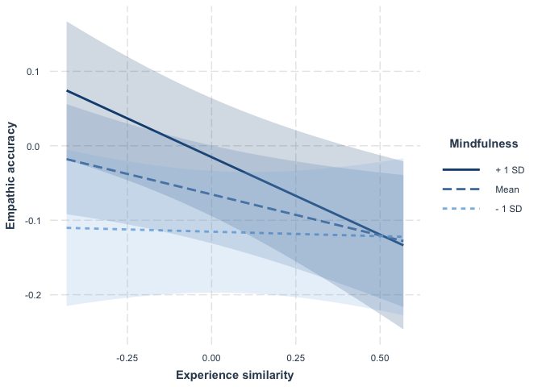
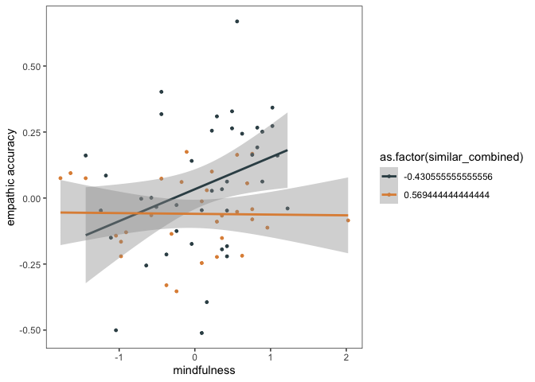

Manuscript Analyses
================
2021-10-21

# load packages

``` r
library("lme4")
library("lmerTest")
library("ggplot2")
library("Rcpp")
library("lm.beta")
library("psych")
library(jtools)
library(dplyr)
library(tidyr)
library(interactions)
library(ggsci)
library(psych)
library(devtools)
```

# load and inspect data

``` r
df <- read.csv('../data/data.csv')

df$cond <- relevel(df$cond, ref='control')


#calculate MAAS mean scores and inspect
df$maas <- rowMeans(df[,c("maas1", "maas2", "maas3", "maas4", "maas5", "maas6", "maas7", "maas8", "maas9", "maas10", "maas11", "maas12", "maas13", "maas14", "maas15")])
hist(df$maas)
```

<!-- -->

``` r
#inspect data and outliers
table(scale(df$EA_corr)) 
```

    ## 
    ##     -3.1645392668706    -3.07465596914571    -2.21054737555838 
    ##                    1                    1                    1 
    ##    -1.90412910424892      -1.738162698615    -1.23208803508038 
    ##                    1                    1                    1 
    ##    -1.17181305360292    -1.02726413365128    -1.01372498463819 
    ##                    1                    1                    1 
    ##    -1.01219964683923   -0.998707067848971   -0.969545959461613 
    ##                    1                    1                    1 
    ##   -0.852617527896701   -0.781955939277333   -0.732328707475188 
    ##                    1                    1                    1 
    ##   -0.684449942659095   -0.605617609622776   -0.598565291778549 
    ##                    1                    1                    1 
    ##   -0.555885877854339    -0.51793304996639   -0.484944857794545 
    ##                    1                    1                    1 
    ##   -0.459929227464312    -0.39125611099966   -0.272793897993294 
    ##                    1                    1                    1 
    ##   -0.249346072349355   -0.229011136236763   -0.157745663280001 
    ##                    1                    1                    1 
    ##   -0.151214816657512  -0.0866108576688696  -0.0645907084167788 
    ##                    1                    1                    1 
    ##   -0.063252441947415  -0.0581025886599026  -0.0392703157186504 
    ##                    1                    1                    1 
    ##  -0.0263375603985506 0.000599976342590358   0.0343171815296938 
    ##                    1                    1                    1 
    ##   0.0990658240844324    0.143001848690392    0.159757381198206 
    ##                    1                    1                    1 
    ##    0.275601533772673    0.284166936526361    0.301188381603894 
    ##                    1                    1                    1 
    ##    0.394178024189448    0.414459359562162    0.420243367701914 
    ##                    1                    1                    1 
    ##    0.420862873343084    0.465508039580772    0.471849135967008 
    ##                    1                    1                    1 
    ##    0.473063901448625     0.51119606913811     0.54727143559811 
    ##                    1                    1                    1 
    ##    0.569981872404723    0.718775729061773    0.790061446414384 
    ##                    1                    1                    1 
    ##     0.79023723694719    0.798964843542554    0.799065217766533 
    ##                    1                    1                    1 
    ##     0.81284057400468    0.837368055546992    0.893175310234056 
    ##                    1                    1                    1 
    ##     1.05596726800062     1.07845535555499     1.08980849413203 
    ##                    1                    1                    1 
    ##     1.11567323614079     1.12350946763157      1.1411564769746 
    ##                    1                    1                    1 
    ##     1.24184449474061     1.26459311444459     1.29253619066669 
    ##                    1                    1                    1 
    ##     1.32805982669351       1.471563068778     1.95116894771882 
    ##                    1                    1                    1

``` r
table(scale(df$factual_accuracy)) 
```

    ## 
    ##  -2.83219408646359  -1.93248142364965  -1.63257720271167  -1.48262509224268 
    ##                  1                  1                  2                  2 
    ##  -1.33267298177369   -1.1827208713047  -1.03276876083571 -0.882816650366725 
    ##                  2                  2                  3                  3 
    ## -0.582912429428747 -0.432960318959757 -0.283008208490768 -0.133056098021779 
    ##                  3                  6                  5                  6 
    ## 0.0168960124472106    0.1668481229162  0.316800233385189  0.466752343854178 
    ##                  3                  4                  3                  5 
    ##  0.616704454323168  0.766656564792157   1.06656078573014   1.21651289619912 
    ##                  3                  2                  2                  3 
    ##   1.36646500666811    1.5164171171371   1.66636922760609   1.81632133807508 
    ##                  6                  1                  1                  1 
    ##   1.96627344854407 
    ##                  1

``` r
table(scale(df$maas))
```

    ## 
    ##   -2.36068413774428   -2.18343140385221   -1.91755230301412   -1.65167320217603 
    ##                   1                   1                   2                   1 
    ##      -1.56304683523   -1.47442046828397   -1.38579410133794   -1.29716773439191 
    ##                   1                   1                   2                   2 
    ##   -1.20854136744587  -0.942662266607782  -0.854035899661752  -0.765409532715721 
    ##                   1                   3                   1                   2 
    ##   -0.67678316576969  -0.588156798823659  -0.499530431877628  -0.410904064931597 
    ##                   2                   4                   2                   1 
    ##  -0.322277697985567  -0.233651331039536  -0.145024964093505 -0.0563985971474742 
    ##                   3                   1                   2                   2 
    ##   0.120854136744587   0.209480503690618   0.298106870636649   0.386733237582679 
    ##                   4                   2                   3                   3 
    ##   0.475359604528711   0.563985971474742   0.652612338420772   0.741238705366803 
    ##                   4                   4                   2                   3 
    ##   0.829865072312834   0.918491439258865     1.0071178062049    1.09574417315093 
    ##                   2                   1                   4                   2 
    ##    1.18437054009696    1.27299690704299    1.36162327398902    1.45024964093505 
    ##                   2                   1                   2                   1 
    ##    1.62750237482711    2.69101877817948 
    ##                   1                   1

``` r
table(df$speaker_similar_exp)# only one person for answer 3
```

    ## 
    ##  1  2  3 
    ## 41 30  1

``` r
df<- dplyr::mutate(df, similar_combined= case_when(
  speaker_similar_exp == 1  ~ 0, 
  speaker_similar_exp == 2  ~ 1, 
  speaker_similar_exp == 3  ~ 1
))  
```

# demographics

``` r
summary(df$age)
```

    ##    Min. 1st Qu.  Median    Mean 3rd Qu.    Max. 
    ##   18.00   20.00   21.00   21.16   22.00   25.00

``` r
sd(df$age)
```

    ## [1] 1.913009

``` r
table (df$race)
```

    ## 
    ##  1  2  4  5  6 
    ## 71  1  1  2  2

# MAAS crombach’s alpha

``` r
df_maas <- df[ , c("maas1", "maas2", "maas3", "maas4", "maas5", "maas6", "maas7",
                      "maas8", "maas9","maas10", "maas11","maas12","maas13", "maas14","maas15")]    
alpha(df_maas)
```

    ## 
    ## Reliability analysis   
    ## Call: alpha(x = df_maas)
    ## 
    ##   raw_alpha std.alpha G6(smc) average_r S/N   ase mean   sd median_r
    ##       0.88      0.89    0.91      0.34 7.9 0.019  3.8 0.75     0.36
    ## 
    ##  lower alpha upper     95% confidence boundaries
    ## 0.85 0.88 0.92 
    ## 
    ##  Reliability if an item is dropped:
    ##        raw_alpha std.alpha G6(smc) average_r S/N alpha se var.r med.r
    ## maas1       0.88      0.89    0.91      0.36 8.0    0.019 0.024  0.37
    ## maas2       0.89      0.89    0.91      0.36 8.0    0.019 0.024  0.37
    ## maas3       0.87      0.88    0.90      0.34 7.1    0.021 0.027  0.33
    ## maas4       0.88      0.88    0.91      0.35 7.4    0.021 0.027  0.36
    ## maas5       0.88      0.89    0.91      0.37 8.1    0.019 0.024  0.37
    ## maas6       0.88      0.89    0.91      0.36 7.8    0.020 0.025  0.36
    ## maas7       0.87      0.87    0.90      0.33 7.0    0.021 0.024  0.33
    ## maas8       0.87      0.87    0.90      0.33 6.8    0.022 0.022  0.32
    ## maas9       0.87      0.87    0.90      0.33 6.9    0.022 0.022  0.33
    ## maas10      0.87      0.87    0.90      0.33 7.0    0.022 0.024  0.35
    ## maas11      0.87      0.88    0.91      0.34 7.2    0.021 0.026  0.33
    ## maas12      0.88      0.88    0.91      0.35 7.4    0.021 0.026  0.35
    ## maas13      0.88      0.88    0.91      0.35 7.5    0.020 0.026  0.36
    ## maas14      0.87      0.87    0.90      0.33 6.8    0.022 0.022  0.33
    ## maas15      0.88      0.89    0.91      0.36 7.8    0.020 0.024  0.37
    ## 
    ##  Item statistics 
    ##         n raw.r std.r r.cor r.drop mean  sd
    ## maas1  77  0.45  0.44  0.39   0.35  3.9 1.3
    ## maas2  77  0.45  0.44  0.38   0.35  4.4 1.4
    ## maas3  77  0.70  0.70  0.68   0.64  3.8 1.2
    ## maas4  77  0.60  0.61  0.58   0.54  3.0 1.1
    ## maas5  77  0.41  0.42  0.36   0.32  4.1 1.1
    ## maas6  77  0.50  0.50  0.45   0.40  2.9 1.3
    ## maas7  77  0.74  0.75  0.74   0.69  3.8 1.0
    ## maas8  77  0.79  0.80  0.80   0.75  4.1 1.1
    ## maas9  77  0.78  0.78  0.78   0.72  3.8 1.3
    ## maas10 77  0.74  0.75  0.74   0.69  3.9 1.1
    ## maas11 77  0.69  0.69  0.66   0.63  3.4 1.2
    ## maas12 77  0.62  0.61  0.57   0.53  4.6 1.4
    ## maas13 77  0.59  0.59  0.55   0.51  2.9 1.2
    ## maas14 77  0.80  0.80  0.80   0.75  3.7 1.2
    ## maas15 77  0.51  0.49  0.44   0.40  4.3 1.4
    ## 
    ## Non missing response frequency for each item
    ##           1    2    3    4    5    6 miss
    ## maas1  0.03 0.10 0.25 0.27 0.22 0.13    0
    ## maas2  0.01 0.14 0.08 0.19 0.36 0.21    0
    ## maas3  0.03 0.08 0.31 0.27 0.25 0.06    0
    ## maas4  0.09 0.23 0.40 0.19 0.05 0.03    0
    ## maas5  0.01 0.05 0.23 0.32 0.29 0.09    0
    ## maas6  0.13 0.30 0.27 0.14 0.12 0.04    0
    ## maas7  0.00 0.10 0.27 0.38 0.21 0.04    0
    ## maas8  0.00 0.08 0.26 0.26 0.32 0.08    0
    ## maas9  0.05 0.12 0.23 0.26 0.29 0.05    0
    ## maas10 0.01 0.10 0.19 0.38 0.23 0.08    0
    ## maas11 0.05 0.14 0.39 0.21 0.17 0.04    0
    ## maas12 0.00 0.10 0.14 0.14 0.27 0.34    0
    ## maas13 0.12 0.23 0.36 0.18 0.09 0.01    0
    ## maas14 0.04 0.12 0.29 0.30 0.18 0.08    0
    ## maas15 0.03 0.09 0.21 0.17 0.29 0.22    0

# transform variables

``` r
#Fisher's r to z transformation
psych::describe(df$EA_corr)
```

    ##    vars  n mean   sd median trimmed  mad  min  max range  skew kurtosis   se
    ## X1    1 72 0.76 0.09   0.77    0.77 0.09 0.48 0.94  0.45 -0.87     1.03 0.01

``` r
# skew  kurtosis  se
#-0.87  1.03      0.01
df$EA_corr_raw =df$EA_corr
df$EA_corr = fisherz(df$EA_corr)

psych::describe(df$EA_corr)
```

    ##    vars  n mean   sd median trimmed  mad  min  max range skew kurtosis   se
    ## X1    1 72 1.04 0.22   1.02    1.04 0.21 0.53 1.71  1.18 0.17     0.34 0.03

``` r
#skew   kurtosis  se
#0.17   0.34      0.03

#mean-center variables
df$maas = df$maas - mean(df$maas,na.rm=T)
df$EA_corr = df$EA_corr - mean(df$EA_corr,na.rm=T)

df$similar_combined_num = df$similar_combined- mean(df$similar_combined,na.rm=T)
df$similar_combined <- as.factor(df$similar_combined_num)  
df$factual_accuracy = df$factual_accuracy - mean(df$factual_accuracy,na.rm=T)
```

# define function to make results table

``` r
make_table = function(model) {
  require(broom)
  require(knitr)
  require(lm.beta)
  
  print(data.frame(R2 = summary(model)$r.squared,
             adjusted_R2 = summary(model)$adj.r.squared,
             df = summary(model)$df[2]) %>%
    knitr::kable(format = "pandoc", digits = 3))
    
  print(model %>%
    broom::tidy(conf.int = TRUE) %>%
    mutate(p.value = ifelse(p.value < .001, "< .001", gsub("0.(.*)", ".\\1", sprintf("%.3f", p.value))),
           `95% CI` = sprintf("%.3f, %.3f", conf.low, conf.high),
           term = gsub("as.factor", "", term)) %>%
    select(-contains("conf")) %>%
    rename("b" = estimate,
           "SE" = std.error,
           "t" = statistic,
           "p" = p.value) %>%
    select(term, b, `95% CI`, everything()) %>%
    knitr::kable(format = "pandoc", digits = 3))
}
```

# Results

# mindfulness \* experience similarity –\> factual accuracy

``` r
test <-lm(factual_accuracy ~similar_combined*maas+cond,df)
make_table(test)
```

    ## 
    ## 
    ##     R2   adjusted_R2   df
    ## ------  ------------  ---
    ##  0.071         0.015   66
    ## 
    ## 
    ## term                                           b  95% CI               SE        t  p    
    ## ---------------------------------------  -------  ---------------  ------  -------  -----
    ## (Intercept)                                1.104  -1.404, 3.613     1.256    0.879  .383 
    ## similar_combined0.569444444444444         -3.351  -6.571, -0.132    1.613   -2.078  .042 
    ## maas                                       0.127  -2.852, 3.106     1.492    0.085  .932 
    ## condcompassion                             0.753  -2.425, 3.932     1.592    0.473  .638 
    ## similar_combined0.569444444444444:maas     0.848  -3.288, 4.983     2.071    0.409  .684

``` r
lm.beta(test)
```

    ## 
    ## Call:
    ## lm(formula = factual_accuracy ~ similar_combined * maas + cond, 
    ##     data = df)
    ## 
    ## Standardized Coefficients::
    ##                            (Intercept)      similar_combined0.569444444444444 
    ##                             0.00000000                            -0.25101054 
    ##                                   maas                         condcompassion 
    ##                             0.01462473                             0.05688250 
    ## similar_combined0.569444444444444:maas 
    ##                             0.07014833

# mindfulness \* experience similarity –\> empathic accuracy

``` r
test <-lm(EA_corr ~ similar_combined*maas +cond,df)
make_table(test)
```

    ## 
    ## 
    ##    R2   adjusted_R2   df
    ## -----  ------------  ---
    ##  0.22         0.174   67
    ## 
    ## 
    ## term                                           b  95% CI               SE        t  p    
    ## ---------------------------------------  -------  ---------------  ------  -------  -----
    ## (Intercept)                               -0.018  -0.092, 0.056     0.037   -0.485  .629 
    ## similar_combined0.569444444444444         -0.110  -0.204, -0.016    0.047   -2.327  .023 
    ## maas                                       0.123  0.035, 0.210      0.044    2.789  .007 
    ## condcompassion                             0.117  0.024, 0.210      0.047    2.509  .015 
    ## similar_combined0.569444444444444:maas    -0.130  -0.252, -0.008    0.061   -2.131  .037

``` r
lm.beta(test)
```

    ## 
    ## Call:
    ## lm(formula = EA_corr ~ similar_combined * maas + cond, data = df)
    ## 
    ## Standardized Coefficients::
    ##                            (Intercept)      similar_combined0.569444444444444 
    ##                              0.0000000                             -0.2548406 
    ##                                   maas                         condcompassion 
    ##                              0.4353589                              0.2736680 
    ## similar_combined0.569444444444444:maas 
    ##                             -0.3317002

# simple slopes analysis

``` r
#+-sd for mindfulness
df$maas_low <- df$maas + sd(df$maas, na.rm=T)
df$maas_high <- df$maas - sd(df$maas, na.rm=T)

test <- lm(EA_corr~ similar_combined*maas_high+as.factor(cond), df)
make_table(test)
```

    ## 
    ## 
    ##    R2   adjusted_R2   df
    ## -----  ------------  ---
    ##  0.22         0.174   67
    ## 
    ## 
    ## term                                                b  95% CI               SE        t  p    
    ## --------------------------------------------  -------  ---------------  ------  -------  -----
    ## (Intercept)                                     0.074  -0.019, 0.167     0.047    1.596  .115 
    ## similar_combined0.569444444444444              -0.208  -0.337, -0.078    0.065   -3.201  .002 
    ## maas_high                                       0.123  0.035, 0.210      0.044    2.789  .007 
    ## (cond)compassion                                0.117  0.024, 0.210      0.047    2.509  .015 
    ## similar_combined0.569444444444444:maas_high    -0.130  -0.252, -0.008    0.061   -2.131  .037

``` r
lm.beta(test)
```

    ## 
    ## Call:
    ## lm(formula = EA_corr ~ similar_combined * maas_high + as.factor(cond), 
    ##     data = df)
    ## 
    ## Standardized Coefficients::
    ##                                 (Intercept) 
    ##                                   0.0000000 
    ##           similar_combined0.569444444444444 
    ##                                  -0.4818452 
    ##                                   maas_high 
    ##                                   0.4353589 
    ##                   as.factor(cond)compassion 
    ##                                   0.2736680 
    ## similar_combined0.569444444444444:maas_high 
    ##                                  -0.4098268

``` r
test <- lm(EA_corr ~ similar_combined*maas +as.factor(cond), df)
make_table(test)
```

    ## 
    ## 
    ##    R2   adjusted_R2   df
    ## -----  ------------  ---
    ##  0.22         0.174   67
    ## 
    ## 
    ## term                                           b  95% CI               SE        t  p    
    ## ---------------------------------------  -------  ---------------  ------  -------  -----
    ## (Intercept)                               -0.018  -0.092, 0.056     0.037   -0.485  .629 
    ## similar_combined0.569444444444444         -0.110  -0.204, -0.016    0.047   -2.327  .023 
    ## maas                                       0.123  0.035, 0.210      0.044    2.789  .007 
    ## (cond)compassion                           0.117  0.024, 0.210      0.047    2.509  .015 
    ## similar_combined0.569444444444444:maas    -0.130  -0.252, -0.008    0.061   -2.131  .037

``` r
lm.beta(test)
```

    ## 
    ## Call:
    ## lm(formula = EA_corr ~ similar_combined * maas + as.factor(cond), 
    ##     data = df)
    ## 
    ## Standardized Coefficients::
    ##                            (Intercept)      similar_combined0.569444444444444 
    ##                              0.0000000                             -0.2548406 
    ##                                   maas              as.factor(cond)compassion 
    ##                              0.4353589                              0.2736680 
    ## similar_combined0.569444444444444:maas 
    ##                             -0.3317002

``` r
test <- lm(EA_corr ~ similar_combined*maas_low +as.factor(cond), df)
make_table(test)
```

    ## 
    ## 
    ##    R2   adjusted_R2   df
    ## -----  ------------  ---
    ##  0.22         0.174   67
    ## 
    ## 
    ## term                                               b  95% CI               SE        t  p    
    ## -------------------------------------------  -------  ---------------  ------  -------  -----
    ## (Intercept)                                   -0.110  -0.215, -0.005    0.053   -2.096  .040 
    ## similar_combined0.569444444444444             -0.012  -0.145, 0.121     0.067   -0.180  .858 
    ## maas_low                                       0.123  0.035, 0.210      0.044    2.789  .007 
    ## (cond)compassion                               0.117  0.024, 0.210      0.047    2.509  .015 
    ## similar_combined0.569444444444444:maas_low    -0.130  -0.252, -0.008    0.061   -2.131  .037

``` r
lm.beta(test)
```

    ## 
    ## Call:
    ## lm(formula = EA_corr ~ similar_combined * maas_low + as.factor(cond), 
    ##     data = df)
    ## 
    ## Standardized Coefficients::
    ##                                (Intercept) 
    ##                                 0.00000000 
    ##          similar_combined0.569444444444444 
    ##                                -0.02783601 
    ##                                   maas_low 
    ##                                 0.43535894 
    ##                  as.factor(cond)compassion 
    ##                                 0.27366805 
    ## similar_combined0.569444444444444:maas_low 
    ##                                -0.39389628

# mindfulness –\> empathic accuracy among subgroups of participants with vs. without similar past experience

``` r
similar_no =subset(df, speaker_similar_exp==1)
similar_yes =subset(df, speaker_similar_exp==2 |  speaker_similar_exp == 3)

test <- lm(EA_corr~ maas+as.factor(cond), similar_no)
make_table(test)
```

    ## 
    ## 
    ##     R2   adjusted_R2   df
    ## ------  ------------  ---
    ##  0.164          0.12   38
    ## 
    ## 
    ## term                     b  95% CI              SE        t  p    
    ## -----------------  -------  --------------  ------  -------  -----
    ## (Intercept)         -0.014  -0.113, 0.086    0.049   -0.280  .781 
    ## maas                 0.122  0.016, 0.229     0.053    2.332  .025 
    ## (cond)compassion     0.107  -0.042, 0.256    0.074    1.460  .153

``` r
lm.beta(test)
```

    ## 
    ## Call:
    ## lm(formula = EA_corr ~ maas + as.factor(cond), data = similar_no)
    ## 
    ## Standardized Coefficients::
    ##               (Intercept)                      maas as.factor(cond)compassion 
    ##                 0.0000000                 0.3459894                 0.2166349

``` r
test <- lm(EA_corr~ maas+as.factor(cond), similar_yes)
make_table(test)
```

    ## 
    ## 
    ##     R2   adjusted_R2   df
    ## ------  ------------  ---
    ##  0.207          0.15   28
    ## 
    ## 
    ## term                     b  95% CI               SE        t  p      
    ## -----------------  -------  ---------------  ------  -------  -------
    ## (Intercept)         -0.135  -0.210, -0.060    0.037   -3.692  < .001 
    ## maas                -0.008  -0.067, 0.050     0.029   -0.285  .778   
    ## (cond)compassion     0.130  0.031, 0.228      0.048    2.701  .012

``` r
lm.beta(test)
```

    ## 
    ## Call:
    ## lm(formula = EA_corr ~ maas + as.factor(cond), data = similar_yes)
    ## 
    ## Standardized Coefficients::
    ##               (Intercept)                      maas as.factor(cond)compassion 
    ##                 0.0000000                -0.0480257                 0.4556634

# Figures

## Figure 1A

``` r
df$Mindfulness <- df$maas
test <- lm(EA_corr~ Mindfulness * similar_combined_num +as.factor(cond), df)
interact_plot(test, pred = similar_combined_num, modx = Mindfulness,
              x.label = "Experience similarity", y.label = "Empathic accuracy", interval=T, int_type="confidence") 
```

<!-- -->

## Figure 1B

``` r
df3 = df %>% 
  dplyr::select("similar_combined","EA_corr", "maas") %>% 
  na.omit()

ggplot(df3) +
  aes(x = maas, y = EA_corr, color = as.factor(similar_combined)) +
  geom_point(size=1) +
  stat_smooth(method = "lm") +
  theme_bw() + theme(panel.grid.minor = element_blank())+  
  theme(panel.grid.major = element_blank()) +  
  xlab("mindfulness")  + ylab("empathic accuracy") +
  scale_color_jama()
```

<!-- -->

``` r
#SI2. Results using non-Fisher r to z transformed empathic accuracy scores

test <-lm(EA_corr_raw ~ similar_combined*maas+cond,df)
make_table(test)
```

    ## 
    ## 
    ##     R2   adjusted_R2   df
    ## ------  ------------  ---
    ##  0.165         0.115   67
    ## 
    ## 
    ## term                                           b  95% CI              SE        t  p      
    ## ---------------------------------------  -------  --------------  ------  -------  -------
    ## (Intercept)                                0.754  0.723, 0.785     0.016   47.842  < .001 
    ## similar_combined0.569444444444444         -0.032  -0.072, 0.008    0.020   -1.595  .116   
    ## maas                                       0.048  0.011, 0.085     0.019    2.562  .013   
    ## condcompassion                             0.042  0.002, 0.082     0.020    2.114  .038   
    ## similar_combined0.569444444444444:maas    -0.050  -0.102, 0.002    0.026   -1.914  .060

``` r
lm.beta(test)
```

    ## 
    ## Call:
    ## lm(formula = EA_corr_raw ~ similar_combined * maas + cond, data = df)
    ## 
    ## Standardized Coefficients::
    ##                            (Intercept)      similar_combined0.569444444444444 
    ##                              0.0000000                             -0.1806585 
    ##                                   maas                         condcompassion 
    ##                              0.4137751                              0.2385746 
    ## similar_combined0.569444444444444:maas 
    ##                             -0.3083990

``` r
#SI3. Treating the experience similarity as a continuous variable. 

df$similar = df$speaker_similar_exp- mean(df$speaker_similar_exp,na.rm=T)

test <-lm(factual_accuracy ~similar*maas+cond,df)
make_table(test)
```

    ## 
    ## 
    ##     R2   adjusted_R2   df
    ## ------  ------------  ---
    ##  0.083         0.028   66
    ## 
    ## 
    ## term                   b  95% CI               SE        t  p    
    ## ---------------  -------  ---------------  ------  -------  -----
    ## (Intercept)       -0.385  -2.600, 1.829     1.109   -0.347  .729 
    ## similar           -3.425  -6.462, -0.389    1.521   -2.252  .028 
    ## maas               0.434  -1.646, 2.514     1.042    0.416  .679 
    ## condcompassion     0.877  -2.290, 4.044     1.586    0.553  .582 
    ## similar:maas       0.920  -3.071, 4.912     1.999    0.460  .647

``` r
lm.beta(test)
```

    ## 
    ## Call:
    ## lm(formula = factual_accuracy ~ similar * maas + cond, data = df)
    ## 
    ## Standardized Coefficients::
    ##    (Intercept)        similar           maas condcompassion   similar:maas 
    ##     0.00000000    -0.27163373     0.04999156     0.06620148     0.05500056

``` r
test <-lm(EA_corr ~ similar*maas+cond,df)
make_table(test)
```

    ## 
    ## 
    ##     R2   adjusted_R2   df
    ## ------  ------------  ---
    ##  0.221         0.175   67
    ## 
    ## 
    ## term                   b  95% CI               SE        t  p    
    ## ---------------  -------  ---------------  ------  -------  -----
    ## (Intercept)       -0.067  -0.133, -0.001    0.033   -2.027  .047 
    ## similar           -0.110  -0.200, -0.021    0.045   -2.462  .016 
    ## maas               0.064  0.002, 0.126      0.031    2.076  .042 
    ## condcompassion     0.118  0.025, 0.211      0.047    2.526  .014 
    ## similar:maas      -0.130  -0.248, -0.011    0.059   -2.186  .032

``` r
lm.beta(test)
```

    ## 
    ## Call:
    ## lm(formula = EA_corr ~ similar * maas + cond, data = df)
    ## 
    ## Standardized Coefficients::
    ##    (Intercept)        similar           maas condcompassion   similar:maas 
    ##      0.0000000     -0.2708243      0.2277464      0.2761104     -0.2388960

``` r
#extra analysis
dfw <- read.csv('../data/data_windowed.csv')
dfw$rAvg = fisherz(dfw$rAvg)

dfw = dfw %>%
  group_by(pID) %>% 
  dplyr::mutate(rAvg_mean= mean(rAvg, na.rm = TRUE),
                val_mean=mean(val, na.rm = TRUE), 
                inten_mean=mean(inten, na.rm = TRUE))

#within-person mean center 
dfw$rAvg = dfw$rAvg - dfw$rAvg_mean 
dfw$val = dfw$val - dfw$val_mean 
dfw$inten = dfw$inten - dfw$inten_mean 
 #grand mean center
dfw$maas = dfw$maas - mean(dfw$maas,na.rm=T)
dfw$similar_combined = dfw$similar_combined- mean(dfw$similar_combined,na.rm=T)
dfw$similar_combined <- as.factor(dfw$similar_combined)  

#speaker's intensity and valence predicting empathic accuracy
summary(lmer(rAvg ~ val * inten + (1|pID) + (1|T), dfw))
```

    ## Linear mixed model fit by REML. t-tests use Satterthwaite's method [
    ## lmerModLmerTest]
    ## Formula: rAvg ~ val * inten + (1 | pID) + (1 | T)
    ##    Data: dfw
    ## 
    ## REML criterion at convergence: 2013.7
    ## 
    ## Scaled residuals: 
    ##     Min      1Q  Median      3Q     Max 
    ## -3.7444 -0.5659  0.0098  0.6540  4.9164 
    ## 
    ## Random effects:
    ##  Groups   Name        Variance                               
    ##  pID      (Intercept) 0.0000000000000000000000000000000005526
    ##  T        (Intercept) 0.1985152174570321004232198447425616905
    ##  Residual             0.4228171137699998638481702073477208614
    ##  Std.Dev.              
    ##  0.00000000000000002351
    ##  0.44555046566806782993
    ##  0.65024388791437315316
    ## Number of obs: 990, groups:  pID, 72; T, 14
    ## 
    ## Fixed effects:
    ##             Estimate Std. Error       df t value Pr(>|t|)
    ## (Intercept) -0.01780    0.12363 11.98722  -0.144    0.888
    ## val          0.07485    0.12493 11.98840   0.599    0.560
    ## inten       -0.09857    0.08753 11.99063  -1.126    0.282
    ## val:inten   -0.04644    0.08517 11.99214  -0.545    0.596
    ## 
    ## Correlation of Fixed Effects:
    ##           (Intr) val    inten 
    ## val       -0.001              
    ## inten      0.055  0.203       
    ## val:inten  0.211 -0.004  0.261
    ## optimizer (nloptwrap) convergence code: 0 (OK)
    ## boundary (singular) fit: see ?isSingular

``` r
#interaction with maas
summary(lmer(rAvg ~ val + inten + val*maas + inten*maas + (1|pID) + (1|T), dfw))
```

    ## Linear mixed model fit by REML. t-tests use Satterthwaite's method [
    ## lmerModLmerTest]
    ## Formula: rAvg ~ val + inten + val * maas + inten * maas + (1 | pID) +  
    ##     (1 | T)
    ##    Data: dfw
    ## 
    ## REML criterion at convergence: 2024.9
    ## 
    ## Scaled residuals: 
    ##     Min      1Q  Median      3Q     Max 
    ## -3.7552 -0.5673  0.0002  0.6443  4.9141 
    ## 
    ## Random effects:
    ##  Groups   Name        Variance                               
    ##  pID      (Intercept) 0.0000000000000000000000000000000005523
    ##  T        (Intercept) 0.1984124077206912972748398260591784492
    ##  Residual             0.4225981395445277954969753864133963361
    ##  Std.Dev.             
    ##  0.0000000000000000235
    ##  0.4454350768862857524
    ##  0.6500754875739646055
    ## Number of obs: 990, groups:  pID, 72; T, 14
    ## 
    ## Fixed effects:
    ##                Estimate  Std. Error          df t value Pr(>|t|)
    ## (Intercept)  -0.0036934   0.1208278  11.9570747  -0.031    0.976
    ## val           0.0748392   0.1248946  11.9608890   0.599    0.560
    ## inten        -0.0863249   0.0844704  11.9660384  -1.022    0.327
    ## maas          0.0008655   0.0273008 972.6782363   0.032    0.975
    ## val:maas      0.0362259   0.0282538 972.6744551   1.282    0.200
    ## inten:maas   -0.0148026   0.0191449 972.6790439  -0.773    0.440
    ## 
    ## Correlation of Fixed Effects:
    ##            (Intr) val    inten  maas   val:ms
    ## val         0.000                            
    ## inten       0.000  0.211                     
    ## maas        0.001  0.000  0.001              
    ## val:maas    0.000  0.000 -0.002  0.004       
    ## inten:maas  0.001 -0.002  0.000  0.008  0.218
    ## optimizer (nloptwrap) convergence code: 0 (OK)
    ## boundary (singular) fit: see ?isSingular

``` r
summary(lmer(rAvg ~ val + inten + val*similar_combined + inten*similar_combined+ (1|pID) + (1|T), dfw))
```

    ## Linear mixed model fit by REML. t-tests use Satterthwaite's method [
    ## lmerModLmerTest]
    ## Formula: 
    ## rAvg ~ val + inten + val * similar_combined + inten * similar_combined +  
    ##     (1 | pID) + (1 | T)
    ##    Data: dfw
    ## 
    ## REML criterion at convergence: 2023.7
    ## 
    ## Scaled residuals: 
    ##     Min      1Q  Median      3Q     Max 
    ## -3.8138 -0.5630  0.0060  0.6484  4.9380 
    ## 
    ## Random effects:
    ##  Groups   Name        Variance                               
    ##  pID      (Intercept) 0.0000000000000000000000000000000005531
    ##  T        (Intercept) 0.1986853042177876282892157178139314055
    ##  Residual             0.4231793811779818170748512784484773874
    ##  Std.Dev.              
    ##  0.00000000000000002352
    ##  0.44574129741116386150
    ##  0.65052239098895114910
    ## Number of obs: 990, groups:  pID, 72; T, 14
    ## 
    ## Fixed effects:
    ##                                           Estimate Std. Error         df
    ## (Intercept)                              -0.002126   0.122222  12.469901
    ## val                                       0.056358   0.126331  12.471901
    ## inten                                    -0.096939   0.085449  12.481361
    ## similar_combined0.569444444444444        -0.003392   0.041800 972.676547
    ## val:similar_combined0.569444444444444     0.043273   0.043350 972.673199
    ## inten:similar_combined0.569444444444444   0.025764   0.029424 972.676354
    ##                                         t value Pr(>|t|)
    ## (Intercept)                              -0.017    0.986
    ## val                                       0.446    0.663
    ## inten                                    -1.134    0.278
    ## similar_combined0.569444444444444        -0.081    0.935
    ## val:similar_combined0.569444444444444     0.998    0.318
    ## inten:similar_combined0.569444444444444   0.876    0.381
    ## 
    ## Correlation of Fixed Effects:
    ##             (Intr) val    inten  s_0.56 v:_0.5
    ## val          0.000                            
    ## inten        0.000  0.211                     
    ## s_0.5694444 -0.146  0.001  0.000              
    ## v:_0.569444  0.001 -0.146 -0.031 -0.006       
    ## i:_0.569444  0.000 -0.031 -0.146  0.003  0.222
    ## optimizer (nloptwrap) convergence code: 0 (OK)
    ## boundary (singular) fit: see ?isSingular
