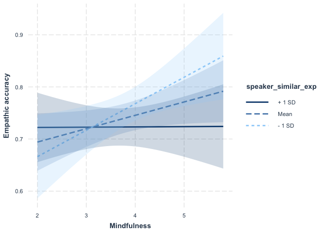

Manuscript Analyses
================
Yoona Kang
2021-05-18

# load packages

``` r
library("lme4")
library("lmerTest")
library("ggplot2")
library("Rcpp")
library("lm.beta")
library("psych")
library(jtools)
library(dplyr)
library(tidyr)
library(interactions)
```

# load and inspect data

``` r
df <- read.csv('~/Box Sync/Varela_Data_822363/data/cleaned/varela_10_21_2020.csv')
df$cond <- relevel(df$cond, ref='control')
colnames(df)[colnames(df)=="Q56"] <- "edu"

table(scale(df$EA_corr)) #2 outliers
```

    ## 
    ##     -3.1645392668706    -3.07465596914571    -2.21054737555838 
    ##                    1                    1                    1 
    ##    -1.90412910424892      -1.738162698615    -1.23208803508038 
    ##                    1                    1                    1 
    ##    -1.17181305360292    -1.02726413365128    -1.01372498463819 
    ##                    1                    1                    1 
    ##    -1.01219964683923   -0.998707067848971   -0.969545959461613 
    ##                    1                    1                    1 
    ##   -0.852617527896701   -0.781955939277333   -0.732328707475188 
    ##                    1                    1                    1 
    ##   -0.684449942659095   -0.605617609622776   -0.598565291778549 
    ##                    1                    1                    1 
    ##   -0.555885877854339    -0.51793304996639   -0.484944857794545 
    ##                    1                    1                    1 
    ##   -0.459929227464312    -0.39125611099966   -0.272793897993294 
    ##                    1                    1                    1 
    ##   -0.249346072349355   -0.229011136236763   -0.157745663280001 
    ##                    1                    1                    1 
    ##   -0.151214816657512  -0.0866108576688696  -0.0645907084167788 
    ##                    1                    1                    1 
    ##   -0.063252441947415  -0.0581025886599026  -0.0392703157186504 
    ##                    1                    1                    1 
    ##  -0.0263375603985506 0.000599976342590358   0.0343171815296938 
    ##                    1                    1                    1 
    ##   0.0990658240844324    0.143001848690392    0.159757381198206 
    ##                    1                    1                    1 
    ##    0.275601533772673    0.284166936526361    0.301188381603894 
    ##                    1                    1                    1 
    ##    0.394178024189448    0.414459359562162    0.420243367701914 
    ##                    1                    1                    1 
    ##    0.420862873343084    0.465508039580772    0.471849135967008 
    ##                    1                    1                    1 
    ##    0.473063901448625     0.51119606913811     0.54727143559811 
    ##                    1                    1                    1 
    ##    0.569981872404723    0.718775729061773    0.790061446414384 
    ##                    1                    1                    1 
    ##     0.79023723694719    0.798964843542554    0.799065217766533 
    ##                    1                    1                    1 
    ##     0.81284057400468    0.837368055546992    0.893175310234056 
    ##                    1                    1                    1 
    ##     1.05596726800062     1.07845535555499     1.08980849413203 
    ##                    1                    1                    1 
    ##     1.11567323614079     1.12350946763157      1.1411564769746 
    ##                    1                    1                    1 
    ##     1.24184449474061     1.26459311444459     1.29253619066669 
    ##                    1                    1                    1 
    ##     1.32805982669351       1.471563068778     1.95116894771882 
    ##                    1                    1                    1

``` r
table(scale(df$factual_accuracy)) #no outlier
```

    ## 
    ##  -2.83219408646359  -1.93248142364965  -1.63257720271167  -1.48262509224268 
    ##                  1                  1                  2                  2 
    ##  -1.33267298177369   -1.1827208713047  -1.03276876083571 -0.882816650366725 
    ##                  2                  2                  3                  3 
    ## -0.582912429428747 -0.432960318959757 -0.283008208490768 -0.133056098021779 
    ##                  3                  6                  5                  6 
    ## 0.0168960124472106    0.1668481229162  0.316800233385189  0.466752343854178 
    ##                  3                  4                  3                  5 
    ##  0.616704454323168  0.766656564792157   1.06656078573014   1.21651289619912 
    ##                  3                  2                  2                  3 
    ##   1.36646500666811    1.5164171171371   1.66636922760609   1.81632133807508 
    ##                  6                  1                  1                  1 
    ##   1.96627344854407 
    ##                  1

``` r
table(scale(df$speaker_similar_exp))#no outlier
```

    ## 
    ## -0.842088836162796    1.0526110452035   2.94731092656979 
    ##                 41                 30                  1

``` r
table(scale(df$maas))#no outlier
```

    ## 
    ##   -2.36068413763512   -2.18343140419136   -1.91755230336103   -1.65167320253069 
    ##                   1                   1                   2                   1 
    ##   -1.56304683514411   -1.47442046775754   -1.38579410170036   -1.29716773431378 
    ##                   1                   1                   2                   2 
    ##    -1.2085413669272  -0.942662266096866  -0.854035900039684  -0.765409532653106 
    ##                   1                   3                   1                   2 
    ##  -0.676783165266529  -0.588156799209347  -0.499530431822771  -0.410904064436193 
    ##                   2                   4                   2                   1 
    ##  -0.322277698379012  -0.233651330992434  -0.145024963605858 -0.0563985975486757 
    ##                   3                   1                   2                   2 
    ##   0.120854137224479    0.20948050328166   0.298106870668237   0.386733238054814 
    ##                   4                   2                   3                   3 
    ##   0.475359604111997   0.563985971498574    0.65261233888515   0.741238704942332 
    ##                   4                   4                   2                   3 
    ##    0.82986507232891   0.918491439715487    1.00711780577267    1.09574417315924 
    ##                   2                   1                   4                   2 
    ##    1.18437054054582      1.272996906603    1.36162327398958    1.45024964137616 
    ##                   2                   1                   2                   1 
    ##    1.62750237481992    2.69101877814126 
    ##                   1                   1

``` r
df2 <- subset(df, EA_corr > .5) #excluding two outliers
```

# demographics

``` r
summary(df$age)
```

    ##    Min. 1st Qu.  Median    Mean 3rd Qu.    Max. 
    ##   18.00   20.00   21.00   21.16   22.00   25.00

``` r
sd(df$age)
```

    ## [1] 1.913009

``` r
table (df$race)
```

    ## 
    ##  1  2  4  5  6 
    ## 71  1  1  2  2

# MAAS crombach’s alpha

``` r
df_maas <- df[ , c("maas1", "maas2", "maas3", "maas4", "maas5", "maas6", "maas7",
                      "maas8", "maas9","maas10", "maas11","maas12","maas13", "maas14","maas15")]    
alpha(df_maas)
```

    ## 
    ## Reliability analysis   
    ## Call: alpha(x = df_maas)
    ## 
    ##   raw_alpha std.alpha G6(smc) average_r S/N   ase mean   sd median_r
    ##       0.88      0.89    0.91      0.34 7.9 0.019  3.8 0.75     0.36
    ## 
    ##  lower alpha upper     95% confidence boundaries
    ## 0.85 0.88 0.92 
    ## 
    ##  Reliability if an item is dropped:
    ##        raw_alpha std.alpha G6(smc) average_r S/N alpha se var.r med.r
    ## maas1       0.88      0.89    0.91      0.36 8.0    0.019 0.024  0.37
    ## maas2       0.89      0.89    0.91      0.36 8.0    0.019 0.024  0.37
    ## maas3       0.87      0.88    0.90      0.34 7.1    0.021 0.027  0.33
    ## maas4       0.88      0.88    0.91      0.35 7.4    0.021 0.027  0.36
    ## maas5       0.88      0.89    0.91      0.37 8.1    0.019 0.024  0.37
    ## maas6       0.88      0.89    0.91      0.36 7.8    0.020 0.025  0.36
    ## maas7       0.87      0.87    0.90      0.33 7.0    0.021 0.024  0.33
    ## maas8       0.87      0.87    0.90      0.33 6.8    0.022 0.022  0.32
    ## maas9       0.87      0.87    0.90      0.33 6.9    0.022 0.022  0.33
    ## maas10      0.87      0.87    0.90      0.33 7.0    0.022 0.024  0.35
    ## maas11      0.87      0.88    0.91      0.34 7.2    0.021 0.026  0.33
    ## maas12      0.88      0.88    0.91      0.35 7.4    0.021 0.026  0.35
    ## maas13      0.88      0.88    0.91      0.35 7.5    0.020 0.026  0.36
    ## maas14      0.87      0.87    0.90      0.33 6.8    0.022 0.022  0.33
    ## maas15      0.88      0.89    0.91      0.36 7.8    0.020 0.024  0.37
    ## 
    ##  Item statistics 
    ##         n raw.r std.r r.cor r.drop mean  sd
    ## maas1  77  0.45  0.44  0.39   0.35  3.9 1.3
    ## maas2  77  0.45  0.44  0.38   0.35  4.4 1.4
    ## maas3  77  0.70  0.70  0.68   0.64  3.8 1.2
    ## maas4  77  0.60  0.61  0.58   0.54  3.0 1.1
    ## maas5  77  0.41  0.42  0.36   0.32  4.1 1.1
    ## maas6  77  0.50  0.50  0.45   0.40  2.9 1.3
    ## maas7  77  0.74  0.75  0.74   0.69  3.8 1.0
    ## maas8  77  0.79  0.80  0.80   0.75  4.1 1.1
    ## maas9  77  0.78  0.78  0.78   0.72  3.8 1.3
    ## maas10 77  0.74  0.75  0.74   0.69  3.9 1.1
    ## maas11 77  0.69  0.69  0.66   0.63  3.4 1.2
    ## maas12 77  0.62  0.61  0.57   0.53  4.6 1.4
    ## maas13 77  0.59  0.59  0.55   0.51  2.9 1.2
    ## maas14 77  0.80  0.80  0.80   0.75  3.7 1.2
    ## maas15 77  0.51  0.49  0.44   0.40  4.3 1.4
    ## 
    ## Non missing response frequency for each item
    ##           1    2    3    4    5    6 miss
    ## maas1  0.03 0.10 0.25 0.27 0.22 0.13    0
    ## maas2  0.01 0.14 0.08 0.19 0.36 0.21    0
    ## maas3  0.03 0.08 0.31 0.27 0.25 0.06    0
    ## maas4  0.09 0.23 0.40 0.19 0.05 0.03    0
    ## maas5  0.01 0.05 0.23 0.32 0.29 0.09    0
    ## maas6  0.13 0.30 0.27 0.14 0.12 0.04    0
    ## maas7  0.00 0.10 0.27 0.38 0.21 0.04    0
    ## maas8  0.00 0.08 0.26 0.26 0.32 0.08    0
    ## maas9  0.05 0.12 0.23 0.26 0.29 0.05    0
    ## maas10 0.01 0.10 0.19 0.38 0.23 0.08    0
    ## maas11 0.05 0.14 0.39 0.21 0.17 0.04    0
    ## maas12 0.00 0.10 0.14 0.14 0.27 0.34    0
    ## maas13 0.12 0.23 0.36 0.18 0.09 0.01    0
    ## maas14 0.04 0.12 0.29 0.30 0.18 0.08    0
    ## maas15 0.03 0.09 0.21 0.17 0.29 0.22    0

# define function to make results table

``` r
make_table = function(model) {
  require(broom)
  require(knitr)
  
  print(data.frame(R2 = summary(model)$r.squared,
             adjusted_R2 = summary(model)$adj.r.squared,
             df = summary(model)$df[2]) %>%
    knitr::kable(format = "pandoc", digits = 3))
    
  print(model %>%
    broom::tidy(conf.int = TRUE) %>%
    mutate(p.value = ifelse(p.value < .001, "< .001", gsub("0.(.*)", ".\\1", sprintf("%.3f", p.value))),
           `95% CI` = sprintf("%.3f, %.3f", conf.low, conf.high),
           term = gsub("as.factor", "", term)) %>%
    select(-contains("conf")) %>%
    rename("b" = estimate,
           "SE" = std.error,
           "t" = statistic,
           "p" = p.value) %>%
    select(term, b, `95% CI`, everything()) %>%
    knitr::kable(format = "pandoc", digits = 3))
}
```

# Results

# past experience –\> factual accuracy

``` r
test <- lm(factual_accuracy ~speaker_similar_exp+cond,df)
make_table(test)
```

    ## 
    ## 
    ##     R2   adjusted_R2   df
    ## ------  ------------  ---
    ##  0.077          0.05   68
    ## 
    ## 
    ## term                        b  95% CI               SE        t  p      
    ## --------------------  -------  ---------------  ------  -------  -------
    ## (Intercept)            48.573  43.981, 53.165    2.301   21.107  < .001 
    ## speaker_similar_exp    -3.543  -6.520, -0.567    1.492   -2.376  .020   
    ## condcompassion          0.923  -2.204, 4.049     1.567    0.589  .558

# past experience –\> empathic accuracy

``` r
test <-lm(EA_corr ~speaker_similar_exp+cond,df)
make_table(test)
```

    ## 
    ## 
    ##     R2   adjusted_R2   df
    ## ------  ------------  ---
    ##  0.083         0.056   69
    ## 
    ## 
    ## term                        b  95% CI              SE        t  p      
    ## --------------------  -------  --------------  ------  -------  -------
    ## (Intercept)             0.793  0.732, 0.853     0.030   26.200  < .001 
    ## speaker_similar_exp    -0.034  -0.073, 0.005    0.020   -1.754  .084   
    ## condcompassion          0.042  0.001, 0.083     0.021    2.033  .046

# excluding outliers

``` r
test <-lm(EA_corr ~speaker_similar_exp+cond,df2)
make_table(test)
```

    ## 
    ## 
    ##     R2   adjusted_R2   df
    ## ------  ------------  ---
    ##  0.173         0.148   67
    ## 
    ## 
    ## term                        b  95% CI               SE        t  p      
    ## --------------------  -------  ---------------  ------  -------  -------
    ## (Intercept)             0.820  0.770, 0.870      0.025   32.610  < .001 
    ## speaker_similar_exp    -0.049  -0.081, -0.016    0.016   -3.012  .004   
    ## condcompassion          0.046  0.012, 0.080      0.017    2.681  .009

# mindfulness \* experience similarity –\> factual accuracy

``` r
test <-lm(factual_accuracy ~maas*speaker_similar_exp+cond,df)
make_table(test)
```

    ## 
    ## 
    ##     R2   adjusted_R2   df
    ## ------  ------------  ---
    ##  0.083         0.028   66
    ## 
    ## 
    ## term                             b  95% CI                SE        t  p      
    ## -------------------------  -------  ---------------  -------  -------  -------
    ## (Intercept)                 51.832  26.932, 76.731    12.471    4.156  < .001 
    ## maas                        -0.896  -7.315, 5.523      3.215   -0.279  .781   
    ## speaker_similar_exp         -6.900  -22.148, 8.347     7.637   -0.904  .370   
    ## condcompassion               0.877  -2.290, 4.044      1.586    0.553  .582   
    ## maas:speaker_similar_exp     0.920  -3.071, 4.912      1.999    0.460  .647

# mindfulness \* experience similarity –\> factual accuracy

``` r
test <-lm(EA_corr ~ maas*speaker_similar_exp +cond,df)
make_table(test)
```

    ## 
    ## 
    ##     R2   adjusted_R2   df
    ## ------  ------------  ---
    ##  0.165         0.116   67
    ## 
    ## 
    ## term                             b  95% CI              SE        t  p    
    ## -------------------------  -------  --------------  ------  -------  -----
    ## (Intercept)                  0.421  0.107, 0.735     0.157    2.677  .009 
    ## maas                         0.097  0.016, 0.178     0.041    2.386  .020 
    ## speaker_similar_exp          0.154  -0.039, 0.346    0.096    1.593  .116 
    ## condcompassion               0.042  0.002, 0.082     0.020    2.117  .038 
    ## maas:speaker_similar_exp    -0.049  -0.100, 0.001    0.025   -1.951  .055

``` r
#excluding outliers
test <-lm(EA_corr ~ maas*speaker_similar_exp +cond,df2)
make_table(test)
```

    ## 
    ## 
    ##    R2   adjusted_R2   df
    ## -----  ------------  ---
    ##  0.23         0.182   65
    ## 
    ## 
    ## term                             b  95% CI              SE        t  p      
    ## -------------------------  -------  --------------  ------  -------  -------
    ## (Intercept)                  0.543  0.274, 0.812     0.135    4.038  < .001 
    ## maas                         0.072  0.003, 0.141     0.034    2.078  .042   
    ## speaker_similar_exp          0.094  -0.069, 0.256    0.081    1.155  .253   
    ## condcompassion               0.047  0.014, 0.080     0.017    2.813  .006   
    ## maas:speaker_similar_exp    -0.037  -0.080, 0.005    0.021   -1.754  .084

# simple slopes analysis

``` r
print(mass_low<- round((mean(df$maas) - sd(df$maas)),1))
```

    ## [1] 3

``` r
print(mass_mid<- round((mean(df$maas)),1))
```

    ## [1] 3.8

``` r
print(mass_high <- round((mean(df$maas) + sd(df$maas)),1))
```

    ## [1] 4.5

``` r
#center variables
df$maas_cen = df$maas - mean(df$maas,na.rm=T)
df$exp_cen = df$speaker_similar_exp- mean(df$speaker_similar_exp,na.rm=T)
df$EA_corr_cen = df$EA_corr - mean(df$EA_corr,na.rm=T)

#+-sd for mindfulness
df$maas_low <- df$maas_cen + sd(df$maas_cen, na.rm=T)
df$maas_high <- df$maas_cen - sd(df$maas_cen, na.rm=T)

test <- lm(EA_corr_cen~ exp_cen*maas_high+as.factor(cond), df)
make_table(test)
```

    ## 
    ## 
    ##     R2   adjusted_R2   df
    ## ------  ------------  ---
    ##  0.165         0.116   67
    ## 
    ## 
    ## term                      b  95% CI               SE        t  p    
    ## ------------------  -------  ---------------  ------  -------  -----
    ## (Intercept)          -0.005  -0.039, 0.029     0.017   -0.281  .779 
    ## exp_cen              -0.070  -0.125, -0.015    0.028   -2.524  .014 
    ## maas_high             0.026  -0.001, 0.052     0.013    1.951  .055 
    ## (cond)compassion      0.042  0.002, 0.082      0.020    2.117  .038 
    ## exp_cen:maas_high    -0.049  -0.100, 0.001     0.025   -1.951  .055

``` r
test <- lm(EA_corr_cen ~ exp_cen*maas_cen +as.factor(cond), df)
make_table(test)
```

    ## 
    ## 
    ##     R2   adjusted_R2   df
    ## ------  ------------  ---
    ##  0.165         0.116   67
    ## 
    ## 
    ## term                     b  95% CI              SE        t  p    
    ## -----------------  -------  --------------  ------  -------  -----
    ## (Intercept)         -0.024  -0.052, 0.004    0.014   -1.715  .091 
    ## exp_cen             -0.033  -0.071, 0.006    0.019   -1.705  .093 
    ## maas_cen             0.026  -0.001, 0.052    0.013    1.951  .055 
    ## (cond)compassion     0.042  0.002, 0.082     0.020    2.117  .038 
    ## exp_cen:maas_cen    -0.049  -0.100, 0.001    0.025   -1.951  .055

``` r
test <- lm(EA_corr_cen ~ exp_cen*maas_low +as.factor(cond), df)
make_table(test)
```

    ## 
    ## 
    ##     R2   adjusted_R2   df
    ## ------  ------------  ---
    ##  0.165         0.116   67
    ## 
    ## 
    ## term                     b  95% CI               SE        t  p    
    ## -----------------  -------  ---------------  ------  -------  -----
    ## (Intercept)         -0.043  -0.078, -0.009    0.017   -2.492  .015 
    ## exp_cen              0.005  -0.048, 0.057     0.026    0.173  .863 
    ## maas_low             0.026  -0.001, 0.052     0.013    1.951  .055 
    ## (cond)compassion     0.042  0.002, 0.082      0.020    2.117  .038 
    ## exp_cen:maas_low    -0.049  -0.100, 0.001     0.025   -1.951  .055

# mindfulness –\> empathic accuracy at different levels of experience similarity

``` r
df$exp_low <- df$exp_cen + sd(df$exp_cen, na.rm=T)
df$exp_high <- df$exp_cen - sd(df$exp_cen, na.rm=T)

test <- lm(EA_corr_cen~ maas*exp_low+as.factor(cond), df)
make_table(test)
```

    ## 
    ## 
    ##     R2   adjusted_R2   df
    ## ------  ------------  ---
    ##  0.165         0.116   67
    ## 
    ## 
    ## term                     b  95% CI               SE        t  p    
    ## -----------------  -------  ---------------  ------  -------  -----
    ## (Intercept)         -0.202  -0.360, -0.044    0.079   -2.553  .013 
    ## maas                 0.052  0.012, 0.092      0.020    2.574  .012 
    ## exp_low              0.154  -0.039, 0.346     0.096    1.593  .116 
    ## (cond)compassion     0.042  0.002, 0.082      0.020    2.117  .038 
    ## maas:exp_low        -0.049  -0.100, 0.001     0.025   -1.951  .055

``` r
test <- lm(EA_corr_cen~ maas*exp_cen+as.factor(cond), df)
make_table(test)
```

    ## 
    ## 
    ##     R2   adjusted_R2   df
    ## ------  ------------  ---
    ##  0.165         0.116   67
    ## 
    ## 
    ## term                     b  95% CI               SE        t  p    
    ## -----------------  -------  ---------------  ------  -------  -----
    ## (Intercept)         -0.121  -0.225, -0.017    0.052   -2.326  .023 
    ## maas                 0.026  -0.001, 0.052     0.013    1.951  .055 
    ## exp_cen              0.154  -0.039, 0.346     0.096    1.593  .116 
    ## (cond)compassion     0.042  0.002, 0.082      0.020    2.117  .038 
    ## maas:exp_cen        -0.049  -0.100, 0.001     0.025   -1.951  .055

``` r
test <- lm(EA_corr_cen~ maas*exp_high+as.factor(cond), df)
make_table(test)
```

    ## 
    ## 
    ##     R2   adjusted_R2   df
    ## ------  ------------  ---
    ##  0.165         0.116   67
    ## 
    ## 
    ## term                     b  95% CI              SE        t  p    
    ## -----------------  -------  --------------  ------  -------  -----
    ## (Intercept)         -0.040  -0.171, 0.091    0.066   -0.606  .546 
    ## maas                 0.000  -0.035, 0.034    0.017   -0.021  .983 
    ## exp_high             0.154  -0.039, 0.346    0.096    1.593  .116 
    ## (cond)compassion     0.042  0.002, 0.082     0.020    2.117  .038 
    ## maas:exp_high       -0.049  -0.100, 0.001    0.025   -1.951  .055

# Figures

``` r
##Figure 1

df$Mindfulness <- df$maas
test <- lm(EA_corr~ Mindfulness * speaker_similar_exp +as.factor(cond), df)
interact_plot(test, pred = speaker_similar_exp, modx = Mindfulness,
              x.label = "Experience similarity", y.label = "Empathic accuracy", interval=T, int_type="confidence") 
```

<!-- -->

``` r
interact_plot(test, pred = Mindfulness, modx = speaker_similar_exp,
              x.label = "Mindfulness", y.label = "Empathic accuracy", interval=T, int_type="confidence") 
```

<!-- -->
